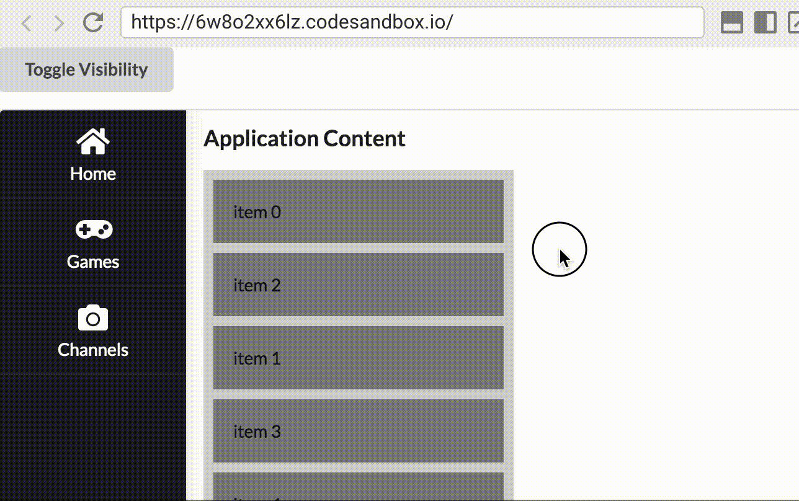

# React Beautiful Dnd

> When I wanted to use this library I had a problem when it was in a fixed and transformed sidebar so I thought it would be helpful if I publish it... Furthermore I found a link where is an example but that is for class component, but I needed it for functional component so this example is made with a functional component.

## Links

* https://codesandbox.io/s/k260nyxq9v?file=/index.js
* https://github.com/atlassian/react-beautiful-dnd/issues/128

## Problem

It was similar to this: https://codesandbox.io/s/6w8o2xx6lz

(Here is its github issue link: https://github.com/atlassian/react-beautiful-dnd/issues/485)

## Solution

You need to use createPortal from 'react-dom'. (https://github.com/atlassian/react-beautiful-dnd/issues/128)

Solution from the comment of @renaudtertrais:
```jsx
const useDraggableInPortal = () => {
    const self = useRef({}).current;

    useEffect(() => {
        const div = document.createElement('div');
        div.style.position = 'absolute';
        div.style.pointerEvents = 'none';
        div.style.top = '0';
        div.style.width = '100%';
        div.style.height = '100%';
        self.elt = div;
        document.body.appendChild(div);
        return () => {
            document.body.removeChild(div);
        };
    }, [self]);

    return (render) => (provided, ...args) => {
        const element = render(provided, ...args);
        if (provided.draggableProps.style.position === 'fixed') {
            return createPortal(element, self.elt);
        }
        return element;
    };
};

const MyComponent = (props) => {
   const renderDraggable = useDraggableInPortal();

  return (
    <DragDropContext onDragEnd={/* ... */}>
      <Droppable droppableId="droppable">
        {({ innerRef, droppableProps, placeholder }) => (
          <div ref={innerRef} {...droppableProps}>
            {props.items.map((item, index) => (
              <Draggable key={item.id} draggableId={item.id} index={index}>
               {renderDraggable((provided) => (
                  <div
                    ref={provided.innerRef}
                    {...provided.draggableProps}
                    {...provided.dragHandleProps}
                  >
                    {item.title}
                  </div>
               ))}
              </Draggable>
            ))}
            {placeholder}
          </div>
        )}
      </Droppable>
    </DragDropContext>
  );
};
```

You can find my solution/example in the src folder in the App.js file.

I hope I could help.